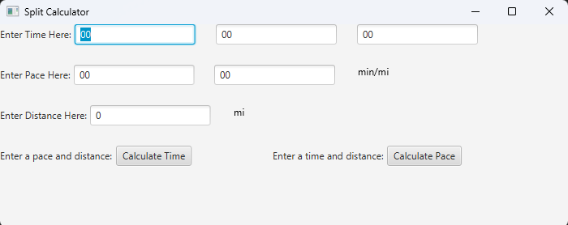
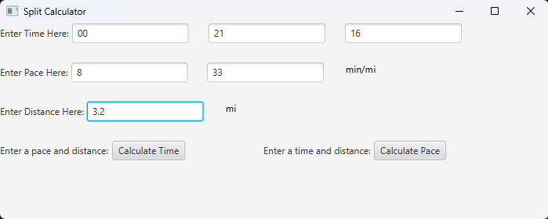
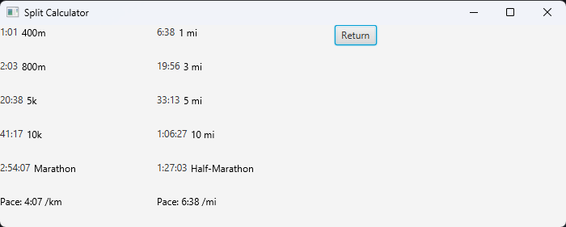
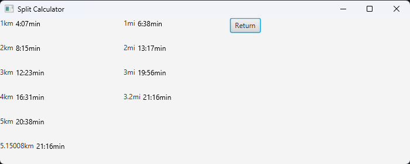

# Split Calculator

## Synopsis
This is a calcultor that provides the time for common running events from a pace or the splits of a run based on time.

## Motivation
Having a pace or split calculator makes planning runs much easier. Also, comparing event times to a pace puts goals in perspective. This removes the hassle of calculation.

## How to Run
Use "Main.java" and have JavaFX. To run, enter a distance (mi), time, and pace (mi/min). Select either calculation button to find the pace or time.
<br><br>

<br>
Shows the program on startup.

## Code Example
This is how the proper number of splits and their times are displayed. The if statment checks for the last whole split and shows the remainder.
```
for (int i = 0; i < arrayLenKm; i++) {
                double tempPaceKm = pace * (i + 1) / KILOMETER;
                // Insert timeString int element "i" and had to vboxKm to display to pane
                txtSplitsKm[i] = new Text(tempPaceString(tempPaceKm) + "min");
                lblSplitsKm[i] = new Label((i + 1) + "km", txtSplitsKm[i]);
                lblSplitsKm[i].setContentDisplay(ContentDisplay.RIGHT);

                vboxKm.getChildren().add(lblSplitsKm[i]);

                // if distance has a decimal, display in last element.
                if (getDistanceKm() % 1 > 0 && i + 1 >= arrayLenKm) {
                    tempPaceKm = pace * getDistanceKm() / KILOMETER;
                    txtSplitsKm[arrayLenKm - 1] = new Text(tempPaceString(tempPaceKm) + "min");
                    lblSplitsKm[arrayLenKm - 1] = new Label((getDistanceKm()) + "km", txtSplitsKm[arrayLenKm - 1]);
                    lblSplitsKm[arrayLenKm - 1].setContentDisplay(ContentDisplay.RIGHT);
                    vboxKm.getChildren().add(lblSplitsKm[arrayLenKm - 1]);
                    
                    i++;
                }
            }
```
This method converts the pace from a ```double``` measured in seconds, to the proper time format. I.e "1:09:23" or "4:01" instead of "1:9:23" or "4:1".
```
public String tempPaceString(Double p) {
            String hrMinCol;
            String secMinCol;

            // formats to x:xx:sec
            if ((int)(p / 60 % 60) >= 10)
                hrMinCol = ":";
            else
                hrMinCol = ":0";

            // formats to hr:xx:xx
            if ((int)(p % 60) >= 10)
                secMinCol = ":";
            else
                secMinCol = ":0";

            // formats to hr:min:sec or min:sec
            if ((int)(p / 3600) > 0)
                return (int)(p / 3600) + hrMinCol + (int)(p / 60 % 60) + secMinCol + (int)(p % 60);
            else
                return (int)(p / 60 % 60) + secMinCol + (int)(p % 60);
        }
```

## Tests
##### Finding a pace
To find the pace required to run in a certain time, enter the distance and time in the appropriate fields. Then select the "Calculate Pace" button. The pace. provided in
km/min and mi/min, are shown at the bottom. Common events such as the 5k are also shown with the time of completion at the calculated pace. <br><br>

<br><br>

##### Finding a time
To find the amount of time to finish a run at a certain pace, enter a distance in miles and a pace in mi/min to the proper fields. Then select the "Calculate Time" button.
The time taken to run each split, given in 1km and 1mi, will be shown. Use the return button to go back to the entry screen. Use the return button to, you
guessed it, return to the entry screen. <br><br>

